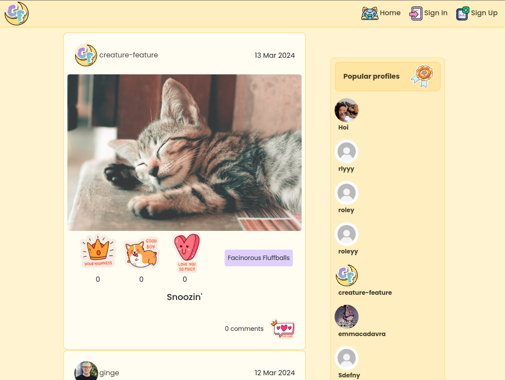
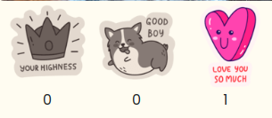

# Creature Feature

## **Project Overview**

Creature Feature is a quirky and fun interactive photo-sharing app dedicated to our often smaller - but by no means lesser - animal companions. Although it shares its name with the famous horror/sci-fi genre of films known as 'Creature Features', the creatures featured on this platform are anything but spooky… Unless they want to be, of course! That said, despite the cutesy aesthetic this app employs, the spirit of the genre is subtly kept alive through the unusual names of the [**_post categories_**](#categories) users must pick from to let the world know what type of creature it is they’re featuring! The thematic combining of the _’creepy & kooky’_ with the charming & adorable provides a truly distinctive, engaging platform for users to _sink their claws into_.

This front-end app is composed from a number of interactive, reusable React components - some of which are independent and can be implemented anywhere, while others may act as containers for a number of child components that are, themselves, reusable. I have made an effort to demonstrate this reusability within the app, and documented more about this in the [**_reusable components_**](#reusable-components) section further down in this README.

To view the deployed web app, [**_please follow this link_**](https://creature-feature-react-fb85071d4bc2.herokuapp.com/)

This is the front-end repository for this project. To go to the back-end repository, [**_please follow this link_**](https://github.com/emmacadavra/creature-feature-drf-api).

To view the deployed Creature Feature back-end API, [**_please follow this link_**](https://creature-feature-api-43ea2b93451a.herokuapp.com/)

## **Table of Contents:**

1. [**Project Overview**](#project-overview)
1. [**Project Planning**](#project-planning)
   - [**Project Goals**](#project-goals)
   - [**User Stories**](#user-stories)
   - [**Design**](#design)
     - [**_Typography_**](#typography)
     - [**_Colour Scheme_**](#colour-scheme)
     - [**_Motifs_**](#motifs)
1. [**Current Features**](#current-features)
   - [**Header and Navigation**](#header-and-navigation)
1. [**Home Page**](#home-page)
   - [**Posts**](#posts)
     - [**_Create and Edit Content_**](#create-and-edit-content)
   - [**Post Filters**](#post-filters)
     - [**_My Feed_**](#my-feed)
     - [**_My Faves_**](#my-faves)
     - [**_Category Search_**](#category-search)
     - [**_Search Bar_**](#search-bar)
   - [**Reactions**](#reactions)
   - [**Infinite Scroll**](#infinite-scroll)
   - [**Create and Edit Content**](#create-and-edit-content)
   - [**Comments**](#comments)
1. [**Profile Page**](#profile-page)
   - [**Popular Profiles**](#popular-profiles)
1. [**Authentication Pages**](#authentication-pages)
   - [**Register**](#register)
   - [**Log In**](#log-in)
   - [**Log Out**](#log-out)
1. [**Resuable Components**](#reusable-components)
1. [**Contexts**](#contexts)
1. [**Technologies and Dependencies**](#technologies-and-dependencies)
1. [**Testing**](#testing)
1. [**Deployment**](#deployment)
1. [**Credits**](#credits)
   - [**Honourable Mentions**](#honourable-mentions)
   - [**Code and Content References**](#code-and-content-references)

## **Project Planning**

### **Project Goals**

The primary intention of this app is to provide a smooth, user-friendly platform on which registered users can - first and foremost - create, view, edit* and delete* (\*if they are the post owner) [**_posts_**](#posts) containing pictures of their beloved pets and favourite animals, and engage with posts created by other users. They can view and follow the [**_profiles_**](#profile-page) of other users whose posts they enjoy, control what they see by utilising a variety of [**_post filters_**](#post-filters), and [**_comment_**](#comments) on the posts they can see. What makes this app stand out against others of its kind are the three [**_adorable post reactions_**](#reactions) that replace ‘likes’ or the more traditional kinds of post reactions found on other social media platforms.

### **User Stories**

My User Stories can be found by following this link to [**_this repository’s project board_**](https://github.com/users/emmacadavra/projects/5). I started with the following six Epics that were then broken down into several User Stories per Epic:

- Navigation & Authentication
- Creating & Editing Posts
- Viewing Posts
- Reactions
- Comments
- Profiles

Although the User Stories relate directly to the front-end of this app, I wrote them very early on as part of the planning stages before starting work on the back-end (which, for the most part, was completed before any work began on the front-end itself).
This helped act as a guide to steer the work that was completed in each sprint to make sure that the MVP was delivered first and foremost. During development of the project, some of the User Stories went through changes, and some were either removed from the project or left unfulfilled due to the potential or scope creep.

To view these User Stories in more detail, and for further information on the agile development process for this project can be found in the separate [**_AGILE.md_**](AGILE.md) document found in this repository.

### **Design**

The overall design of this website reflects almost exactly what I had in mind from the very start of this project. Initially my ideas were a little more chaotic, but I was happy to discover all of the wonderful icons and stickers used on the site from [**_Flaticon_**](https://www.flaticon.com/) that helped pull the theme together.

#### **Typography**

The main logo for this website was created with [**_TextStudio Editor_**](https://www.textstudio.com/editor):

Because of this, I only felt it necessary to obtain one font from [**_Google Fonts_**], for the main body of the website. The font used is called 'Poppins', and I felt it was a perfect fit for the site by being clear and readable, but just different enough compared with other standard fonts to make it stand out.

#### **Colour Scheme**

I use quite a lot of different colours throughout this app, all of which are documented below. At almost all times, the text colour is black (with a slight degree of opacity to make it less harsh on the eyes) on top of lighter colours, and the brighter colours are used either as borders or to indicate hover/active states. Please see the [**_EightShapes colour grid_**](https://contrast-grid.eightshapes.com/?version=1.1.0&background-colors=&foreground-colors=%23000000%0D%0A%23fffcf0%2C%0D%0A%23ffefba%2C%0D%0A%23fce59b%2C%0D%0A%23deceff%2C%0D%0A%23b996ff%2C%0D%0A%23baf5ff%2C%0D%0A%2397e9f8%2C%0D%0A%23f2e6fa%2C%0D%0A%23bd75e8%2C%0D%0A%239715e2%2C%0D%0A%23c1f7b4%2C%0D%0A%239fe78d%2C%0D%0A%2388d8c1%2C%0D%0A%235ea591%2C%0D%0A%234db497%2C%0D%0A%23e1a2f5%2C%0D%0A%23d062f1%0D%0A%0D%0A&es-color-form__tile-size=compact&es-color-form__show-contrast=aaa&es-color-form__show-contrast=aa&es-color-form__show-contrast=aa18&es-color-form__show-contrast=dnp) below that shows the colours used and how the black text interacts with each of them:

# **Current Features**

## **Header and Navigation**

### **Navbar**

The Creature Feature site's navbar sits at the top of the screen and is always visible to the user. It contains the brand logo on the left-hand side, and links on the right-hand side that respond differently depending on whether a user is logged in or out.

Logged out:

Logged in:

On smaller screens. the menu collapses into a React Bootstrap burger menu:

## **Home Page**

The Homepage is the main container for the site's content, outside of individual profiles and sign in/sign out pages.

Desktop view (logged in):

It contains three main sections: first, for logged in users, it displays a summary of their profile information on the left. This is the MyProfile component.

The second (and main) section is the [**_Posts_**](#posts) section. Posts contains several smaller components, including the CreateEditPost form and PostFilters, and of course the list of Posts. The CreateEditPost button and PostFilters are not visible to logged out users:

The third section is the PopularProfiles component, which appears on the right-hand side on larger screens, but moves to the top of the page on smaller screens:

### **Posts**

The Posts component is one of the most important components in the app, as it houses the CreateEditPost component, the PostFilters component, and the Post component which, in turn, houses several other components such as the [**_ReactionsBar_**](#reactions) component and of course [**_Comments_**](#comments). It is utilised in two places: the homepage, where it displays all posts by default, newest first, or any list of posts that meet the filtering or search terms the user has input.

#### **Create and Edit Content**

Clicking on the 'Create Post' button as a logged in user opens the CreateEditPost component, and allows users to create new posts:

In addition to this, if the owner of a post wishes to update that post, a small meatballs icon appears in the top-right corner, with an edit option:

Clicking this will open the same CreateEditPost component, but it will do so in place so that the user can update the post without navigating anywhere else to do so:

### **Post Filters**

The PostFilters component enables users to control the content they see on the homepage by using filters set by the back-end, or by using their own search terms through the SearchBar.

#### **My Feed**

'My Feed' only shows posts by profiles that the currently logged in user is following.

#### **My Faves**

'My Faves' only shows posts that the currently logged in user has reacted to, in order of most recent reactionfirst (as opposed to most recently uploaded post first).

#### **Category Search**

The categorory search buttons only show posts that are tagged with that specific category. The three categories to choose from are "Facinorous Fluffballs"(ie, all fluffy animals!), "Reptillian Villains" (for reptiles and the like), and "Feathered Fiends" for birds.

#### **Search Bar**

The search bar allows users to type in keywords to search for posts. The search will apply to both usernames and the titles of posts. If there aren't any posts containing those keywords, the following graphic appears:

### **Reactions**

The ReactionsBar component is what makes this site particularly unique. There are three options, named in the back-end as "CROWN", "GOOD", and "LOVE". Only one of these reactions can be chosen per post, per user, and the UI updates depending on whether they have reacted to it. Post owners are not able to click on the reactions for their post, as they cannot react to their own posts.

Default (no reaction/post owner view):

UI updated depending on reaction chosen by user, and users can switch between them freely:

If a user is not logged in and tries to react to a post, an overlay pops up to tell them they need to log in to do so:

### **Infinite Scroll**

The [**_React Infinite Scroll Component_**](https://www.npmjs.com/package/react-infinite-scroll-component) was used to allow pposts on the homepage to infinitely load, 10 posts at a time (the default page limit set in the back-end). This improves user experience by allowing them to keep scrolling rather than deal with 'next' and 'previous' buttons.

### **Comments**

A small icon appears at the bottom-right of the Post component that tells users how many comments a post has, and by clicking on the icon the comments for the post are expanded beneath it:

If a user is logged in, they will see the option to create a comment:

Users who are not logged in cannot see the option to add a comment:

Users can also like comments, and the UI updates in a similar fashion to that of the ReactionsBar component:

Logged out users see an overlay that tells them they need to sign in to like comments:

## **Profile Page**

When a user creates an account, a new profile is created for them which they can edit. A user's profile contains their profile information and all posts made by that user:

It displays the number of posts that user has made, the number of accounts they are following, and the number of followers they currently have.

Similar to editing posts and comments, when the owner of a profile wants to edit their profile information, the UserProfile component is replaced with the EditProfile form so that they are not navigated away from the page.

### **Popular Profiles**

### **Authentication Pages**

#### **Register**

#### **Log In**

#### **Log Out**

## **Reusable Components**

## **Contexts**

## **Technologies and Dependencies**

### **Frameworks**

### **Libraries**

## **Testing**

A separate file has been created for information about testing. Please click the following link to access it: [**_TESTING.md_**](TESTING.md)

## **Deployment**

### Getting Started with Create React App

This project was bootstrapped with [Create React App](https://github.com/facebook/create-react-app).

### Available Scripts

In the project directory, you can run:

#### `npm start`

Runs the app in the development mode.\
Open [http://localhost:3000](http://localhost:3000) to view it in your browser.

The page will reload when you make changes.\
You may also see any lint errors in the console.

#### `npm test`

Launches the test runner in the interactive watch mode.\
See the section about [running tests](https://facebook.github.io/create-react-app/docs/running-tests) for more information.

#### `npm run build`

Builds the app for production to the `build` folder.\
It correctly bundles React in production mode and optimizes the build for the best performance.

The build is minified and the filenames include the hashes.\
Your app is ready to be deployed!

See the section about [deployment](https://facebook.github.io/create-react-app/docs/deployment) for more information.

#### `npm run eject`

**Note: this is a one-way operation. Once you `eject`, you can't go back!**

If you aren't satisfied with the build tool and configuration choices, you can `eject` at any time. This command will remove the single build dependency from your project.

Instead, it will copy all the configuration files and the transitive dependencies (webpack, Babel, ESLint, etc) right into your project so you have full control over them. All of the commands except `eject` will still work, but they will point to the copied scripts so you can tweak them. At this point you're on your own.

You don't have to ever use `eject`. The curated feature set is suitable for small and middle deployments, and you shouldn't feel obligated to use this feature. However we understand that this tool wouldn't be useful if you couldn't customize it when you are ready for it.

### Learn More

You can learn more in the [Create React App documentation](https://facebook.github.io/create-react-app/docs/getting-started).

To learn React, check out the [React documentation](https://reactjs.org/).

#### Code Splitting

This section has moved here: [https://facebook.github.io/create-react-app/docs/code-splitting](https://facebook.github.io/create-react-app/docs/code-splitting)

#### Analyzing the Bundle Size

This section has moved here: [https://facebook.github.io/create-react-app/docs/analyzing-the-bundle-size](https://facebook.github.io/create-react-app/docs/analyzing-the-bundle-size)

#### Making a Progressive Web App

This section has moved here: [https://facebook.github.io/create-react-app/docs/making-a-progressive-web-app](https://facebook.github.io/create-react-app/docs/making-a-progressive-web-app)

#### Advanced Configuration

This section has moved here: [https://facebook.github.io/create-react-app/docs/advanced-configuration](https://facebook.github.io/create-react-app/docs/advanced-configuration)

#### Deployment

This section has moved here: [https://facebook.github.io/create-react-app/docs/deployment](https://facebook.github.io/create-react-app/docs/deployment)

#### `npm run build` fails to minify

This section has moved here: [https://facebook.github.io/create-react-app/docs/troubleshooting#npm-run-build-fails-to-minify](https://facebook.github.io/create-react-app/docs/troubleshooting#npm-run-build-fails-to-minify)

## **Credits**

### **Honourable Mentions**

- [**_Damon Kreft_**](https://github.com/damon-kreft) - As always, I cannot sing highly enough your praises for your undying support, enthusiasm for my learning journey, and for always being there for me throughout what has been the most challenging thing I have done yet. Your love and kindness has made it possible to make it through!

- [**_Richard Wells_**](https://github.com/D0nni387) - Would that I could express in words just how grateful I am for your mentorship throughout this project, and the whole of my CI course. You are always positive and reassuring, caring and always somehow seem to find the time to help the students you mentor. Thank you!!!

- Thank you to all of my wonderful friends that helped me populate the app with posts, and enriched my life with pictures of their adorable pets! A special shout out to [**_Kieran Peat_**](https://github.com/kieranpeat) who took the extra time to test certain elements of the app, such as attempting to include HTML in post content, and updated me on his results. You are the best!

### **Code and Content References**

#### **Code**

- This project was created using [**_Code Institute_**](https://codeinstitute.net/)'s course content and 'Moments' walkthrough project as the original template for this project to build upon. There are many areas of my code that will have been taken directly from the course content, and I have not felt it necessary to change. For example, the 'Asset', 'Avatar' and 'MoreDropdown' components, the 'useClickOutsideToggle' hook, the 'axiosDefaults' API file and most instances of Forms (with the slight exception of having updated them to work with the most recent version of React Bootstrap) within the project are courtesy of CI's walkthrough.
- There are many pieces of code in this project that have been taken directly from [**_React Bootstrap's documentation_**](https://react-bootstrap.github.io/), and in some cases without making any amendments to the code itself at all. In particular, the Overlay used in the ReactionsBar uses code lifted directly from the Overlay page in this documentation. Due to the complexity of the ReactionsBar, I struggled with the (admittedly preferable) OverlayTrigger component, and decided in the end that this Overlay worked perfectly fine:
  - 

#### **Content and Media**

- Logo and brand text generated by [**_TextStudio Editor_**](https://www.textstudio.com/editor)
- Favicon files generated from TextStudio Logo using [**_Real Favicon Generator_**](https://realfavicongenerator.net/)
- PNG Stickers edited using [**_Pixlr_**](https://pixlr.com/)

##### **Icons:**

_Please note the unique URLs linked for each icon._

- [**_Home icon by Freepik on Flaticon_**](https://www.flaticon.com/free-icon/cat_2571964)
- [**_Sign In icon by Freepik on Flaticon_**](https://www.flaticon.com/free-icon/log-in_2161403)
- [**_Sign Out icon by Freepik on Flaticon_**](https://www.flaticon.com/free-icon/log-out_2161487)
- [**_Sign Up icon by Freepik on Flaticon_**](https://www.flaticon.com/free-icon/new-post_7420707)
- [**_Create Post icon by Freepik on Flaticon_**](https://www.flaticon.com/free-icon/add-photo_5808163)
- [**_My Feed icon by Freepik on Flaticon_**](https://www.flaticon.com/free-icon/social-media_5976347)
- [**_My Faves icon by Freepik on Flaticon_**](https://www.flaticon.com/free-icon/social-media_5976335)
- [**_Upload Image icon by Freepik on Flaticon_**](https://www.flaticon.com/free-icon/upload_2161444)
- [**_Change Image icon by Freepik on Flaticon_**](https://www.flaticon.com/free-icon/camera_8719664)
- [**_No Results icon by Freepik on Flaticon_**](https://www.flaticon.com/free-icon/search_7409412)
- [**_Search icon by Freepik on Flaticon_**](https://www.flaticon.com/free-icon/magnifying-glass_9406832)
- [**_Three Dots icon by Freepik on Flaticon_**](https://www.flaticon.com/free-icon/kebab-menu_11932812)
- [**_Edit Profile icon by Freepik on Flaticon_**](https://www.flaticon.com/free-icon/magic-wand_9274146)
- [**_Edit Post/Comment icon by Freepik on Flaticon_**](https://www.flaticon.com/free-icon/edit_8080670)
- [**_Bin icon by Freepik on Flaticon_**](https://www.flaticon.com/free-icon/trash-can_3299937)
- [**_Like comment icon by Freepik on Flaticon_**](https://www.flaticon.com/free-icon/heart_2073120)

##### **Stickers:**

_Please note the unique URLS linked for each sticker._

- [**_Love sticker by barnstudio on Flaticon_**](https://www.flaticon.com/free-sticker/heart_6426857)
- [**_Good sticker by barnstudio on Flaticon_**](https://www.flaticon.com/free-sticker/dog_6426758)
- [**_Crown sticker by barnstudio on Flaticon_**](https://www.flaticon.com/free-sticker/crown_6426909)
- [**_Comment sticker by barnstudio on Flaticon_**](https://www.flaticon.com/free-sticker/symbol_6426862)
- [**_Popular profiles badge sticker by Gohsantosadrive on Flaticon_**](https://www.flaticon.com/free-sticker/badge_7602822)

##### **Images (used in posts):**

- [**_Ghost cat image_**](https://imagitory.tumblr.com/post/151766195042/my-ghostcat) by williamcrisafi on Tumblr (found on imagitory.tumblr.com)
- [**_Parrots Perched on Brown Wooden Surface_**](https://www.pexels.com/photo/parrots-perched-on-brown-wooden-surface-1599452/) by Magda Ehlers from Pexels
- [**_White Duckling on Grass_**](https://www.pexels.com/photo/white-duckling-on-grass-55834/) by Pixabay
- [**_Beige Python on Brown Branch of Tree_**](https://www.pexels.com/photo/beige-python-on-brown-branch-of-tree-1108192/) by Worldspectrum
- [**_Close-Up Photography of Sleeping Tabby Cat_**](https://www.pexels.com/photo/close-up-photography-of-sleeping-tabby-cat-1056251/) by Ihsan Adityawarman
