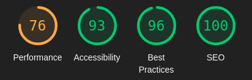
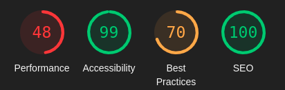
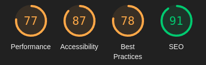

# **Creature Feature - Testing**

## **Table of Contents (Testing):**

1. [**Testing Overview**](#testing-overview)
1. [**Testing Throughout Development**](#testing-throughout-development)
   - [**Manual Testing**](#manual-testing)
   - [**Testing and Quality Control Tools**](#testing-and-quality-control-tools)
   - [**Noteworthy Bugs During Development**](#noteworthy-bugs-during-development)
1. [**Post Development Testing**]
   - [**Code Validation**](#code-validation)
     - [**_Lighthouse Scores_**](#lighthouse-scores)
   - [**Unresolved Bugs**](#unresolved-bugs)
1. [**User Story Testing**](#user-story-testing)
   - [**Navigation & Authentication**](#user-stories-navigation--authentication)
   - [**Creating & Editing Posts**](#user-stories-creating--editing-posts)
   - [**Viewing Posts**](#user-stories-viewing-posts)
   - [**Reactions**](#user-stories-reactions)
   - [**Comments**](#user-stories-comments)
   - [**Profiles**](#user-stories-profiles)

## **Testing Overview**

Below I have documented the testing undertaken throughout development for this respository's code.

For information on back-end testing, please follow the link to this project's [**_back end respository's TESTING.md document_**](https://github.com/emmacadavra/creature-feature-drf-api/blob/main/TESTING.md).

## **Testing Throughout Development**

### **Manual Testing**

A lot of testing work was undertaken throughout this project in both the back and front-end counterparts to ensure that things ran smoothly and without errors, though I found that this front-end app required the most testing as I encountered significantly more bugs with my React code than with the back-end Python/Django code. I believe this is in part because it is newer to me but also because back-end code is much more linear whereas in the UI there is a lot more complexity around managing the live state of the UI and user interactions.

I did enlist the help of several friends to try and use all of the functionality within the site to not only validate it but to also 'break it' to try to find bugs. That included:

- Interacting with elements in ways that I didn't necessarily expect.
- Some attempting to inject HTML/Javascript snippets into form posts.
- Entering other unusual information into forms, such as just white spaces.
- More tech-savvy friends testing security by trying to e.g. create posts masquerading as another users by sending requests directly to the backend (outside of the UI).

### **Testing and Quality Control Tools**

I used a variety of methods to test my code as I went along, in particular making frequent use of console logs (_a LOT of console logs_) to track the journey of data being passed between functions or components, and to identify where the code stops working if I encountered errors, bugs, or generally undesired results.

I am aware of the debug tools available in VSCode that could allow me to add 'breakpoints' and step through code but I unfortunately did not have time to properly learn and utilise this to comfortable degree.

I did leverage the following tools to help with my code quality during this project:

- [**Prettier**](https://prettier.io/) to ensure my code style is consistent across all of my files.
- [**ESLint**](https://eslint.org/) to help catch code problems early.
- [**Todo Tree**](https://marketplace.visualstudio.com/items?itemName=Gruntfuggly.todo-tree) to keep track of in-code 'todo's' to come back to and address.

### **Noteworthy Bugs During Development**

- Certain characters in my code were not escaping properly (namely apostrophes) which caused errors in my code and in some cases prevented the site from running at all. This was fixed by replacing the offending apostrophes with `&apos;`.
- No error handling was appearing when attempting to upload an image that’s too big. This was fixed by adding a react `useState` to capture and show errors on the form.
- The 'ProfileDataContext' component caused an infinite loop of requesting the list of profiles over and over again. This was because the profile ID being pulled from the URL was a string, but the comparison used to stop those requests expected a number. Converting the string value to a number using `Number(profileId)` fixed this issue.
- In the MoreDropdown component, I was getting the eslint error "Component definition is missing display name" when trying to use React Bootstrap’s custom dropdown code. To fix this, I added `ThreeDotsMeatballs.displayName = "ThreeDotsMeatballs"` below the code.
- When creating the CreateEditPost component, at first the form was not rendering and throwing the error “Element type is invalid: expected a string (for built-in components) or a class/function (for composite components) but got: undefined”. I realised this was due to me following the course content, which used an earlier version of React Bootstrap. I replaced “Form.File” with “Form.Control” with type= “file”, which fixed the issue.
- In the PostFilters component, `useNavigate` was not working correctly, as users do not navigate to different pages on the homepage. The initial solution was to keep the query in the URL in sync with the text field by using useSearchParams. However, this caused the search bar to either not allow being typed into (if `value={query}`), or it was keeping the searched keywords in the search bar after clicking Home (if `defaultValue={query}`). Additionally, by making it a controlled form, debounce was no longer working. The solution I used for this is to manually keep the text field in sync by getting the element from the DOM directly, and updating it that way.

## Post Development Testing

### **Code Validation**

CODE VALIDATION

#### **Lighthouse Scores**

Below are the Lighthouse testing results for the two main pages - he Homepage and Profile page.

The performance score in particular is much lower than I would like, as given the nature of the site, it is at the whim of the images uploaded by other uses. I would like to add more work around image optimisation if I had more time to improve on that. Additionally, the best practice score is not ideal, but this is due to recent changes in the way Lighthouse operates in regards to third-party cookies. The way that the back-end API is set up with Django AllAuth and Django Rest Auth means that cookies are always created, which brought the score down.

##### **Homepage scores:**

##### **Profile page scores:**

### **Unresolved Bugs**

- The back end would return a '500 Server Error' when uploading a certain image when creating a post. It appears it was due to a comma being used in the file name, but I can't be entirely certain of this due to the vague error that came back from the database. Even after implementing error handling, that specific file creates the same vague error so I am not able to confidently say what the source of the bug is.
- When a logged in user clicks the three dots menu icon (to edit/delete content), which uses React Bootstrap's Dropdown component, the user has to click on it three times in order for it to activate (but only the first time they do so in each instance). I and my mentor are both still unclear as to what causes this to happen.

## **User Story Testing**

My User Stories can be found by following this link to [**_this repository’s project board_**](https://github.com/users/emmacadavra/projects/5). Further information on these User Stories can be found in the separate [**_AGILE.md_**](AGILE.md) document found in this repository. Below, I have detailed how I tested the User Stories through the front-end.

### **User Stories: Navigation & Authentication**

| **_USER STORY_** | **Complete?** |
| :--------------- | :-----------: |
| TEST             |    &check;    |
| TEST             |    &check;    |
| TEST             |    &check;    |

| **_USER STORY_** | **Complete?** |
| :--------------- | :-----------: |
| TEST             |    &check;    |
| TEST             |    &check;    |
| TEST             |    &check;    |

### **User Stories: Creating & Editing Posts**

| **_USER STORY_** | **Complete?** |
| :--------------- | :-----------: |
| TEST             |    &check;    |
| TEST             |    &check;    |
| TEST             |    &check;    |

| **_USER STORY_** | **Complete?** |
| :--------------- | :-----------: |
| TEST             |    &check;    |
| TEST             |    &check;    |
| TEST             |    &check;    |

### **User Stories: Viewing Posts**

| **_USER STORY_** | **Complete?** |
| :--------------- | :-----------: |
| TEST             |    &check;    |
| TEST             |    &check;    |
| TEST             |    &check;    |

| **_USER STORY_** | **Complete?** |
| :--------------- | :-----------: |
| TEST             |    &check;    |
| TEST             |    &check;    |
| TEST             |    &check;    |

### **User Stories: Reactions**

| **_USER STORY_** | **Complete?** |
| :--------------- | :-----------: |
| TEST             |    &check;    |
| TEST             |    &check;    |
| TEST             |    &check;    |

| **_USER STORY_** | **Complete?** |
| :--------------- | :-----------: |
| TEST             |    &check;    |
| TEST             |    &check;    |
| TEST             |    &check;    |

### **User Stories: Comments**

| **_USER STORY_** | **Complete?** |
| :--------------- | :-----------: |
| TEST             |    &check;    |
| TEST             |    &check;    |
| TEST             |    &check;    |

| **_USER STORY_** | **Complete?** |
| :--------------- | :-----------: |
| TEST             |    &check;    |
| TEST             |    &check;    |
| TEST             |    &check;    |

### **User Stories: Profiles**

| **_USER STORY_** | **Complete?** |
| :--------------- | :-----------: |
| TEST             |    &check;    |
| TEST             |    &check;    |
| TEST             |    &check;    |

| **_USER STORY_** | **Complete?** |
| :--------------- | :-----------: |
| TEST             |    &check;    |
| TEST             |    &check;    |
| TEST             |    &check;    |

Please click the following link to return to the [**_README.md_**](README.md) document.
