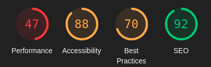

# **Creature Feature - Testing**

## **Table of Contents (Testing):**

1. [**Testing Overview**](#testing-overview)
1. [**Testing Throughout Development**](#testing-throughout-development)
   - [**Manual Testing**](#manual-testing)
   - [**Testing and Quality Control Tools**](#testing-and-quality-control-tools)
   - [**Noteworthy Bugs During Development**](#noteworthy-bugs-during-development)
1. [**Post Development Testing**]
   - [**Code Validation**](#code-validation)
     - [**_Lighthouse Scores_**](#lighthouse-scores)
   - [**Unresolved Bugs**](#unresolved-bugs)
1. [**User Story Testing**](#user-story-testing)
   - [**Navigation & Authentication**](#user-stories-navigation--authentication)
   - [**Creating & Editing Posts**](#user-stories-creating--editing-posts)
   - [**Viewing Posts**](#user-stories-viewing-posts)
   - [**Reactions**](#user-stories-reactions)
   - [**Comments**](#user-stories-comments)
   - [**Profiles**](#user-stories-profiles)

## **Testing Overview**

Below I have documented the testing undertaken throughout development for this respository's code.

For information on back-end testing, please follow the link to this project's [**_back end respository's TESTING.md document_**](https://github.com/emmacadavra/creature-feature-drf-api/blob/main/TESTING.md).

## **Testing Throughout Development**

### **Manual Testing**

A lot of testing work was undertaken throughout this project in both the back and front-end counterparts to ensure that things ran smoothly and without errors, though I found that this front-end app required the most testing as I encountered significantly more bugs with my React code than with the back-end Python/Django code. I believe this is in part because it is newer to me but also because back-end code is much more linear whereas in the UI there is a lot more complexity around managing the live state of the UI and user interactions.

I did enlist the help of several friends to try and use all of the functionality within the site to not only validate it but to also 'break it' to try to find bugs. That included:

- Interacting with elements in ways that I didn't necessarily expect.
- Some attempting to inject HTML/Javascript snippets into form posts.
- Entering other unusual information into forms, such as just white spaces.
- More tech-savvy friends testing security by trying to e.g. create posts masquerading as another users by sending requests directly to the backend (outside of the UI).

### **Testing and Quality Control Tools**

I used a variety of methods to test my code as I went along, in particular making frequent use of console logs (_a LOT of console logs_) to track the journey of data being passed between functions or components, and to identify where the code stops working if I encountered errors, bugs, or generally undesired results.

I am aware of the debug tools available in VSCode that could allow me to add 'breakpoints' and step through code but I unfortunately did not have time to properly learn and utilise this to comfortable degree.

I did leverage the following tools to help with my code quality during this project:

- [**Prettier**](https://prettier.io/) to ensure my code style is consistent across all of my files.
- [**ESLint**](https://eslint.org/) to help catch code problems early.
- [**Todo Tree**](https://marketplace.visualstudio.com/items?itemName=Gruntfuggly.todo-tree) to keep track of in-code 'todo's' to come back to and address.

### **Noteworthy Bugs During Development**

As mentioned above, I found that I came across significantly more bugs in my front-end code than I did in my back-end code, and this is largely due to React being new to me. I also made the choice to use the most recent versions of Create React App, as well as the newest versions of React Bootstrap and React Router Dom, whereas most of my learning material used previous versions of all three - this meant that I spent a lot of time fixing bugs that I had caused by unknowingly using outdated and/or incompatible code. Below are a few of the most noteworthy bugs I encountered - some are simple, but some much more complex from my view that often took much, much longer to resolve than anticipated!

- Certain characters in my code were not escaping properly (namely apostrophes) which caused errors in my code and in some cases prevented the site from running at all. This was fixed by replacing the offending apostrophes with `&apos;`.
- No error handling was appearing when attempting to upload an image that’s too big. This was fixed by adding a react `useState` to capture and show errors on the form.
- The 'ProfileDataContext' component caused an infinite loop of requesting the list of profiles over and over again. This was because the profile ID being pulled from the URL was a string, but the comparison used to stop those requests expected a number. Converting the string value to a number using `Number(profileId)` fixed this issue.
- In the MoreDropdown component, I was getting the eslint error "Component definition is missing display name" when trying to use React Bootstrap’s custom dropdown code. To fix this, I added `ThreeDotsMeatballs.displayName = "ThreeDotsMeatballs"` below the code.
- When creating the CreateEditPost component, at first the form was not rendering, and throwing the error “Element type is invalid: expected a string (for built-in components) or a class/function (for composite components) but got: undefined”. I realised this was due to me following the course content, which used an earlier version of React Bootstrap. I replaced “Form.File” with “Form.Control” with type= “file”, which fixed the issue.
- In the PostFilters component, `useNavigate` was not working correctly, as users do not navigate to different pages on the homepage. The initial solution was to keep the query in the URL in sync with the text field by using useSearchParams. However, this caused the search bar to either not allow being typed into (if `value={query}`), or it was keeping the searched keywords in the search bar after clicking Home (if `defaultValue={query}`). Additionally, by making it a controlled form, debounce was no longer working. The solution I used for this is to manually keep the text field in sync by getting the element from the DOM directly, and updating it that way.

## Post Development Testing

### **Code Validation**

CODE VALIDATION

#### **Lighthouse Scores**

Below are the Lighthouse testing results for the two main pages - he Homepage and Profile page.

The performance score in particular is much lower than I would like, as given the nature of the site, it is at the whim of the images uploaded by other uses. I would like to add more work around image optimisation if I had more time to improve on that. Additionally, the best practice score is not ideal, but this is due to recent changes in the way Lighthouse operates in regards to third-party cookies. The way that the back-end API is set up with Django AllAuth and Django Rest Auth means that cookies are always created, which brought the score down.

##### **Homepage scores:**

##### **Profile page scores:**

### **Unresolved Bugs**

- The back end would return a '500 Server Error' when uploading a certain image when creating a post. It appears it was due to a comma being used in the file name, but I can't be entirely certain of this due to the vague error that came back from the database. Even after implementing error handling, that specific file creates the same vague error so I am not able to confidently say what the source of the bug is.
- When a logged in user clicks the three dots menu icon (to edit/delete content), which uses React Bootstrap's Dropdown component, the user has to click on it three times in order for it to activate (but only the first time they do so in each instance). I and my mentor are both still unclear as to what causes this to happen.

## **User Story Testing**

My User Stories can be found by following this link to [**_this repository’s project board_**](https://github.com/users/emmacadavra/projects/5). Further information on these User Stories can be found in the separate [**_AGILE.md_**](AGILE.md) document found in this repository. Below, I have detailed how I tested the User Stories through the front-end. Testing for these User Stories relating to the back-end can be found in the [**_back-end repository's TESTING.md document_**](https://github.com/emmacadavra/creature-feature-drf-api/blob/main/TESTING.md).

### **User Stories: Navigation & Authentication**

| **As a user I can view the navbar from every page so that I can easily navigate between pages**                                                                                                                                                                                                                                    | **Complete?** |
| :--------------------------------------------------------------------------------------------------------------------------------------------------------------------------------------------------------------------------------------------------------------------------------------------------------------------------------- | :-----------: |
| Open the website as both a logged out user and a logged in user, and navigate through each main page (Home, Sign Up, Sign In, Profile, Sign Out) to confirm that the navbar is present in the same position on all pages, with the only differences being the contents of the navbar based on whether the user is logged in or not |    &check;    |

| **As a user I can navigate through pages quickly so that I can view content seamlessly without page refresh**                                                                                                                                             | **Complete?** |
| :-------------------------------------------------------------------------------------------------------------------------------------------------------------------------------------------------------------------------------------------------------- | :-----------: |
| Open the website as both a logged out user and a logged in user, and navigate through each main page (Home, Sign Up, Sign In, Profile, Sign Out) to confirm that the main page area is rendering/re-rendering each page seamlessly without a hard refresh |    &check;    |
| As a logged in user, navigate between Home, My Feed, My Faves, and the three category tags to confirm that the only thing re-rendering is the Posts component, and that the page never refreshes                                                          |    &check;    |
| Click on all profiles in the Popular Profiles component to check that the profile page only re-renders the profile information, and does not refresh                                                                                                      |    &check;    |
| Clicking on the Creature Feature logo or the 'Home' button in the navbar clears all search filters without hard refreshing the page                                                                                                                       |    &check;    |

| **As a user I can create a new account so that I can access all the features for signed up users**                                                           | **Complete?** |
| :----------------------------------------------------------------------------------------------------------------------------------------------------------- | :-----------: |
| When a user is not signed in or registered, the 'Sign Up' button appears clearly in the navbar on all pages, directing the user to the sign up form          |    &check;    |
| Clicking the 'Sign Up' form in the navbar directs the user to the sign up form seamlessly without hard refreshing                                            |    &check;    |
| Ensure that error handling and data validation in the sign up form are working correctly by trying to sign up with empty fields and invalid/mismatching data |    &check;    |
| Upon sign up, the user is redirected to the sign in form so that they can sign in                                                                            |    &check;    |

| **As a user I can sign in to the app so that I can access functionality for logged in users**                                                                                                         | **Complete?** |
| :---------------------------------------------------------------------------------------------------------------------------------------------------------------------------------------------------- | :-----------: |
| When a user is not signed in, the 'Sign In' button appears clearly in the navbar on all pages, directing the user to the sign in form                                                                 |    &check;    |
| Clicking the 'Sign In' form in the navbar directs the user to the sign in form seamlessly without hard refreshing                                                                                     |    &check;    |
| Ensure that error handling and data validation in the sign in form are working correctly - users cannot log in with invalid credentials                                                               |    &check;    |
| Upon sign in, the user is redirected to the home page, where they can see all the functionality only available for logged in users, such as the ability to create posts and filter their content feed |    &check;    |

| **As a user I can clearly see if I am logged in or not so that I can log in if I need to, or log out if I want to**                                                                                | **Complete?** |
| :------------------------------------------------------------------------------------------------------------------------------------------------------------------------------------------------- | :-----------: |
| Test to make sure the 'Sign In' and 'Sign Up' buttons in the navbar are only ever visible to users who are not logged in                                                                           |    &check;    |
| When a user is logged in, test to make sure that the 'Sign Out' and 'My Profile' buttons in the navbar are clearly visible on every page                                                           |    &check;    |
| When a user is logged in and on the Home page, the option to create posts, filter content, and view their personalised feeds are above the content feed - logged out users are unable to see these |    &check;    |
| When a user is logged in, they can see three dots on posts and comments they have made, which are not otherwise visible                                                                            |    &check;    |

| **As a user I can maintain my logged-in status until I choose to log out so that my user experience is not compromised**                                                                                                                                      | **Complete?** |
| :------------------------------------------------------------------------------------------------------------------------------------------------------------------------------------------------------------------------------------------------------------ | :-----------: |
| Thanks to JWT, users are able to remain logged in if they wish, even after closing the website and coming back later - tested across various accounts on various browsers by logging in, closing the site and coming back later to find I was still logged in |    &check;    |

| **As a logged out user I can see sign in and sign up options so that I can sign in/sign up**                                                                                         | **Complete?** |
| :----------------------------------------------------------------------------------------------------------------------------------------------------------------------------------- | :-----------: |
| When a user is not signed in/registered, the 'Sign Up' and 'Sign In' buttons appear clearly in the navbar on all pages, directing the user to the sign up/sign in forms respectively |    &check;    |

### **User Stories: Creating & Editing Posts**

| **As a logged in user I can clearly see the button to add a post**                                                                                                                           | **Complete?** |
| :------------------------------------------------------------------------------------------------------------------------------------------------------------------------------------------- | :-----------: |
| Check to see that logged in users are able to see the 'Create Post' button on the Home and Profile page (if the profile belongs to the logged in user) - consistently appears on all devices |    &check;    |
| Test to check that logged out users are unable to see this button - consistently hidden for all logged out users on all devices tested                                                       |    &check;    |

| **As a logged in user I can create posts so that I can feature my creatures!**                                                                                                                                         | **Complete?** |
| :--------------------------------------------------------------------------------------------------------------------------------------------------------------------------------------------------------------------- | :-----------: |
| When a logged in user clicks on the 'Create Post' button, the create post form opens on the same page, without redirecting the user or refreshing                                                                      |    &check;    |
| Test that all fields marked as required are functioning correctly and that error handling shows the correct error messages by attempting to create a post with no data, then no data in each required field one by one |    &check;    |
| Test that, if a post is uploaded with no image, the specified default image is used by default so that the field is populated on the back-end, preventing errors                                                       |    &check;    |
| When a user creates a post, the create post form automatically closes itself and the post is added to the top of the user's content feed seamlessly without needing to refresh the whole page                          |    &check;    |

| **As a logged in user, I can choose a category for my post so that users know which kind of creature I’m featuring!**                                                              | **Complete?** |
| :--------------------------------------------------------------------------------------------------------------------------------------------------------------------------------- | :-----------: |
| When a logged in user opens the create post form, the categories can clearly be seen above the 'Post Me!' button, and it is automatically populated with the first one on the list |    &check;    |
| Upon creating a post, a colourful 'tag' is clearly visible in the post description that matches the colours for the category filters for easy recognition                          |    &check;    |
| If a user decides to change the category of a post when editing it, the new category is recorded and the original category tag is removed                                          |    &check;    |

| **As a logged in post owner I can edit my post title and description so that I can make corrections or update my post after it was created**                                                                                      | **Complete?** |
| :-------------------------------------------------------------------------------------------------------------------------------------------------------------------------------------------------------------------------------- | :-----------: |
| When a logged in post owner decides they want to edit a post, the create post form appears in place of the original post, pre-populated with the data from the post for a positive user experience that avoids reloading the page |    &check;    |
| Test that all fields marked as required are functioning correctly and that error handling shows the correct error messages by attempting to edit a post to contain no data, then no data in each required field one by one        |    &check;    |
| Test that, if a user wants to update the text content of their post but not the image, the original image they uploaded remains rather than being replaced by the default                                                         |    &check;    |
| Accounts can only edit posts they own - tested across various accounts, the three pink dots are only every visible to post owners, and posts cannot be edited using their ID in the URL                                           |    &check;    |

### **User Stories: Viewing Posts**

| **As a user I can view all the most recent posts, ordered by most recently created first so that I am up to date with the newest content**                                                                   | **Complete?** |
| :----------------------------------------------------------------------------------------------------------------------------------------------------------------------------------------------------------- | :-----------: |
| Upon site load, for both logged in and logged out users, the Home page feed renders a list of posts that are ordered by most recent first                                                                    |    &check;    |
| Posts by individuals on their profile page are also displayed in date descending order                                                                                                                       |    &check;    |
| When a user edits a post they have made, that post does not get bumped to the top of the list, as the posts display in date descending order based on the time and date they were created on, not updated on |    &check;    |

| **As a user, I can search for posts with keywords, so that I can find the posts and user profiles I am interested in**                                                                                                                       | **Complete?** |
| :------------------------------------------------------------------------------------------------------------------------------------------------------------------------------------------------------------------------------------------- | :-----------: |
| Logged in users can clearly see a search bar above their content feed, below the post filters, that allows them to type search terms to find posts                                                                                           |    &check;    |
| The search bar searches post titles, categories and usernames for the search terms                                                                                                                                                           |    &check;    |
| Users receive clear confirmation if they enter a search term that brings up no results                                                                                                                                                       |    &check;    |
| Search terms are linked to the URL, enabling users to share specific searches by URL if they wanted to, and changing the search term in the URL updates the text in the search bar to match                                                  |    &check;    |
| Upon clicking the 'Home' button or the Creature Feature logo in the navbar, the URL is cleared and this also clears the search bar to prevent errors and avoid confusion                                                                     |    &check;    |
| The search bar has a delay before performing the search in order to prevent the post list flashing unpleasantly while the user types                                                                                                         |    &check;    |
| Entering in a search term while there are additional filters that are applied does not remove those filters and works harmoniously with them                                                                                                 |    &check;    |
| Logged out users are unable to see the search bar, but the URL search terms will still display, enabling users to share searches with friends via URL - this encourages unregistered users to create an account if they want to search posts |    &check;    |

| **As a logged in user, I can view the posts I have reacted to so that I can revisit the posts I enjoy the most**                                                                                                    | **Complete?** |
| :------------------------------------------------------------------------------------------------------------------------------------------------------------------------------------------------------------------ | :-----------: |
| Logged in users can clearly see the 'My Faves' button above their content feed on the Home page                                                                                                                     |    &check;    |
| The 'My Faves' filter will always display posts with the most recently reacted to first, regardless of how new or old the post is, for a better overall user experience                                             |    &check;    |
| When viewing the 'My Faves' feed, users can use additional search terms to search through the posts they have reacted to by typing into the search bar, as well as clicking a category button to filter by category |    &check;    |
| The 'My Faves' feed, like other post filters, is only available on the Home page and cannot be used to filter individual profiles' posts to prevent confusion                                                       |    &check;    |
| Logged out users are unable to see the option to filter posts by reaction, as a logged in profile ID must be used to determine which posts should be displayed                                                      |    &check;    |

| **As a logged in user I can view content filtered by users I follow so that I can keep up to date with what they are posting about**                                                                                | **Complete?** |
| :------------------------------------------------------------------------------------------------------------------------------------------------------------------------------------------------------------------ | :-----------: |
| Logged in users can clearly see the 'My Feed' button above their content feed on the Home page                                                                                                                      |    &check;    |
| The 'My Feed' filter will always display posts with the most recently posted first, in continuity with the main feed                                                                                                |    &check;    |
| When viewing the 'My Feed' feed, users can use additional search terms to search through posts made by users they follow by typing into the search bar, as well as clicking a category button to filter by category |    &check;    |
| The 'My Feed' feed, like other post filters, is only available on the Home page and cannot be used to filter individual profiles' posts to prevent confusion                                                        |    &check;    |
| Logged out users are unable to see the option to filter posts by followed users, as a logged in profile ID must be used to determine which posts should be displayed                                                |    &check;    |

| **As a user, I can filter posts by category so that I can view posts featuring specific types of creature**                                                                                                                       | **Complete?** |
| :-------------------------------------------------------------------------------------------------------------------------------------------------------------------------------------------------------------------------------- | :-----------: |
| Logged in users can clearly see the three category buttons above their content feed on the Home page                                                                                                                              |    &check;    |
| The colours assigned to these buttons remain consistent with the colour of the corresponding 'tags' displayed on each post to show which category the post falls into                                                             |    &check;    |
| When a user clicks a category button, only posts in that category are displayed, in date descending order (newest first) to remain consistent with the main feeds                                                                 |    &check;    |
| When viewing individual category feeds, users can use additional search terms to search through posts in these categories by typing into the search bar - they can also be used in tandem with the 'My Faves' and 'My Feed' feeds |    &check;    |
| The individual category feeds, like other post filters, are only available on the Home page and cannot be used to filter individual profiles' posts to prevent confusion                                                          |    &check;    |
| Logged out users are unable to see the option to filter posts by category                                                                                                                                                         |    &check;    |

| **As a user I can keep scrolling through the images on the site, that are loaded for me automatically so that I don't have to click on "next page" etc.**                                                                                                                                                    | **Complete?** |
| :----------------------------------------------------------------------------------------------------------------------------------------------------------------------------------------------------------------------------------------------------------------------------------------------------------- | :-----------: |
| Only 10 posts are loaded at a time to improve site performance                                                                                                                                                                                                                                               |    &check;    |
| When a user scrolls to the 'bottom' of the page, the API fetches the next 10 posts and displays them beneath the first 10                                                                                                                                                                                    |    &check;    |
| When a user scrolls to the 'next' page, a loading spinner appears briefly as the data is being fetched, but the page does not refresh for a better user experience                                                                                                                                           |    &check;    |
| When a user scrolls to the 'next' page, but more posts have been created in the time between them loading the page and scrolling to the 'bottom' (causing the posts that were on page 1 to now show on page 2, for example), the API removes any "duplicate" posts so the user experience is not interrupted |    &check;    |
| This behaviour is the same on the posts section of individual profile pages                                                                                                                                                                                                                                  |    &check;    |

### **User Stories: Reactions**

| **As a user, I can clearly see the reaction choices for posts with how many of each reaction next to them, so that I can see what other users think about posts** | **Complete?** |
| :---------------------------------------------------------------------------------------------------------------------------------------------------------------- | :-----------: |
| TEST                                                                                                                                                              |    &check;    |
| TEST                                                                                                                                                              |    &check;    |
| TEST                                                                                                                                                              |    &check;    |

| **As a logged in user, I can react to a post with clear visual feedback that I have done so, so that I know how I have reacted and understand I can only pick one** | **Complete?** |
| :------------------------------------------------------------------------------------------------------------------------------------------------------------------ | :-----------: |
| TEST                                                                                                                                                                |    &check;    |
| TEST                                                                                                                                                                |    &check;    |
| TEST                                                                                                                                                                |    &check;    |

| **As a logged in user, I can click/tap again on a reaction to undo it, with clear visual feedback that I have done so, so that I can choose a different reaction if I change my mind** | **Complete?** |
| :------------------------------------------------------------------------------------------------------------------------------------------------------------------------------------- | :-----------: |
| TEST                                                                                                                                                                                   |    &check;    |
| TEST                                                                                                                                                                                   |    &check;    |
| TEST                                                                                                                                                                                   |    &check;    |

### **User Stories: Comments**

| **As a logged in user, I can click to expand and read the comments under posts so that I can read what other users think about the posts** | **Complete?** |
| :----------------------------------------------------------------------------------------------------------------------------------------- | :-----------: |
| TEST                                                                                                                                       |    &check;    |
| TEST                                                                                                                                       |    &check;    |
| TEST                                                                                                                                       |    &check;    |

| **As a logged in user I can add comments to a post so that I can share my thoughts about the post** | **Complete?** |
| :-------------------------------------------------------------------------------------------------- | :-----------: |
| TEST                                                                                                |    &check;    |
| TEST                                                                                                |    &check;    |
| TEST                                                                                                |    &check;    |

| **As a user I can see how long ago a comment was made so that I know how old a comment is** | **Complete?** |
| :------------------------------------------------------------------------------------------ | :-----------: |
| TEST                                                                                        |    &check;    |
| TEST                                                                                        |    &check;    |
| TEST                                                                                        |    &check;    |

| **As a logged in owner of a comment I can edit my comment so that I can fix or update my existing comment** | **Complete?** |
| :---------------------------------------------------------------------------------------------------------- | :-----------: |
| TEST                                                                                                        |    &check;    |
| TEST                                                                                                        |    &check;    |
| TEST                                                                                                        |    &check;    |

| **As a logged in owner of a comment I can delete my comment so that I can control removal of my comment from the application** | **Complete?** |
| :----------------------------------------------------------------------------------------------------------------------------- | :-----------: |
| TEST                                                                                                                           |    &check;    |
| TEST                                                                                                                           |    &check;    |
| TEST                                                                                                                           |    &check;    |

| **As a logged in user I can like the comments of other users so that I can show support or agreement as to what other users have to say** | **Complete?** |
| :---------------------------------------------------------------------------------------------------------------------------------------- | :-----------: |
| TEST                                                                                                                                      |    &check;    |
| TEST                                                                                                                                      |    &check;    |
| TEST                                                                                                                                      |    &check;    |

### **User Stories: Profiles**

| **As a user I can view user's avatars so that I can easily identify users of the application and their posts** | **Complete?** |
| :------------------------------------------------------------------------------------------------------------- | :-----------: |
| TEST                                                                                                           |    &check;    |
| TEST                                                                                                           |    &check;    |
| TEST                                                                                                           |    &check;    |

| **As a user I can see a list of the most followed profiles so that I can see which profiles are popular** | **Complete?** |
| :-------------------------------------------------------------------------------------------------------- | :-----------: |
| TEST                                                                                                      |    &check;    |
| TEST                                                                                                      |    &check;    |
| TEST                                                                                                      |    &check;    |

| **As a user I can view other users profiles so that I can see their posts and learn more about them** | **Complete?** |
| :---------------------------------------------------------------------------------------------------- | :-----------: |
| TEST                                                                                                  |    &check;    |
| TEST                                                                                                  |    &check;    |
| TEST                                                                                                  |    &check;    |

| **As a user I can view statistics about a specific user: bio, number of posts, follows and users followed so that I can learn more about them** | **Complete?** |
| :---------------------------------------------------------------------------------------------------------------------------------------------- | :-----------: |
| TEST                                                                                                                                            |    &check;    |
| TEST                                                                                                                                            |    &check;    |
| TEST                                                                                                                                            |    &check;    |

| **As a logged in user I can follow and unfollow other users so that I can see and remove posts by specific users in my posts feed** | **Complete?** |
| :---------------------------------------------------------------------------------------------------------------------------------- | :-----------: |
| TEST                                                                                                                                |    &check;    |
| TEST                                                                                                                                |    &check;    |
| TEST                                                                                                                                |    &check;    |

| **As a user I can view all the posts by a specific user so that I can catch up on their latest posts, or decide I want to follow them** | **Complete?** |
| :-------------------------------------------------------------------------------------------------------------------------------------- | :-----------: |
| TEST                                                                                                                                    |    &check;    |
| TEST                                                                                                                                    |    &check;    |
| TEST                                                                                                                                    |    &check;    |

| **As a logged in user I can edit my profile so that I can change my profile picture and bio** | **Complete?** |
| :-------------------------------------------------------------------------------------------- | :-----------: |
| TEST                                                                                          |    &check;    |
| TEST                                                                                          |    &check;    |
| TEST                                                                                          |    &check;    |

Please click the following link to return to the [**_README.md_**](README.md) document.
